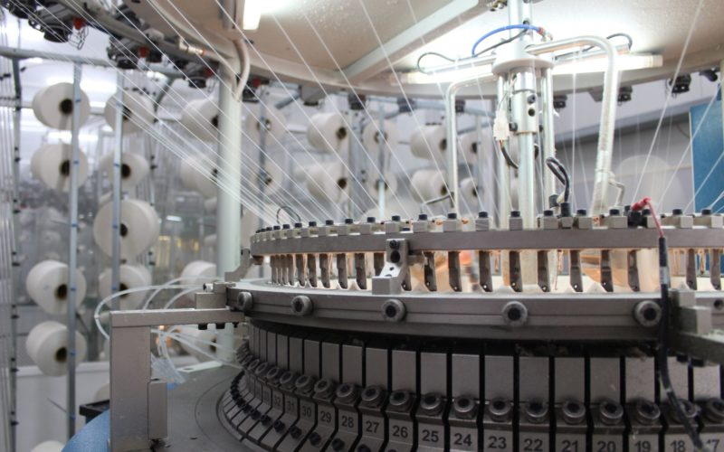
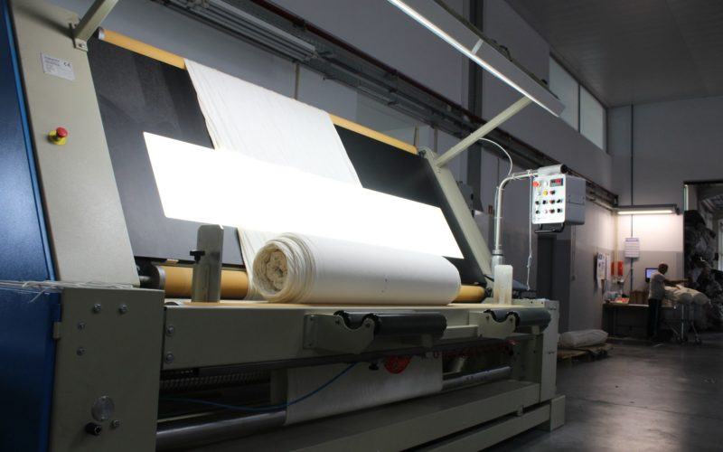

# Estimating the GSM of Raw Fabric for Industrialized Applications

  

## Project Overview

This project aims to develop a robust tool for estimating the GSM (Grams per Square Meter) of circular knitted raw fabric in industrial settings. 

The accurate measurement of GSM is critical for maintaining quality control, optimizing material usage, and ensuring the end product meets the required standards. 

This tool is designed to streamline the process, reduce errors, and increase efficiency in fabric production.

  

### Problem Framing

In this project the aim is to estimate the GSM of a given circular knitted raw fabric based on the used yarn (or yarns) the yarn count the machine settings and so on. 
Since the GSM is of a continuous value this is a Supervised Learning with a Continuous value problem, meaning we can use Regression algorithms. 

I gathered 324 instances of produced circular knitted raw fabric, having 28 of features per each instance. 
Since the dataset was very scarce, I splitted the data by 70% train and 30% test sets. 
for all my training settings I used K-fold cross validation with k=100, since the dataset is very limited. 

### Training Details

I tried several supervised learning algorithms to train on the data: 
- Random Forest Regression 
- Support Vector Machine for Regression (SVR) 
- Ridge Regression 

#### 1) Random Forest Regression
Using Random Forest Regression with 100 Trees, I got an average RMSE of 17.91 on the dev set, and 20.48 on the test set. 
Meaning I'm off by approximately 20.50 gr/m2 on average. 

#### 2) SVM for Regression

First I tried Linear SVM with a regularization paramter of 1.0 and a margin of 0.1 : 
dev set average RMSE = 28.9 
test set average RMSE 30.6 

Then, I tried SVM with higher dimensional features, with a 7th degree polynomial, regularization parameter = 1.0, margin = 0.1, independent (constant) term = 1.5 : 
dev set average RMSE = 24.87 
test set average RMSE = 25.00 

#### 3) Ridge Regression
with alpha = 1.0 : 
dev set average RMSE = 24.58 
test set average RMSE = 26.15 

### Conclusion
As a conclusion it's clear that the Random Forest model was the most capable, although the data was very limited.  

